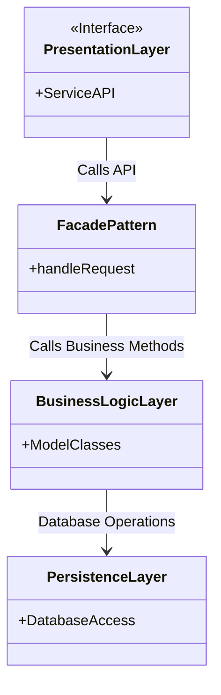
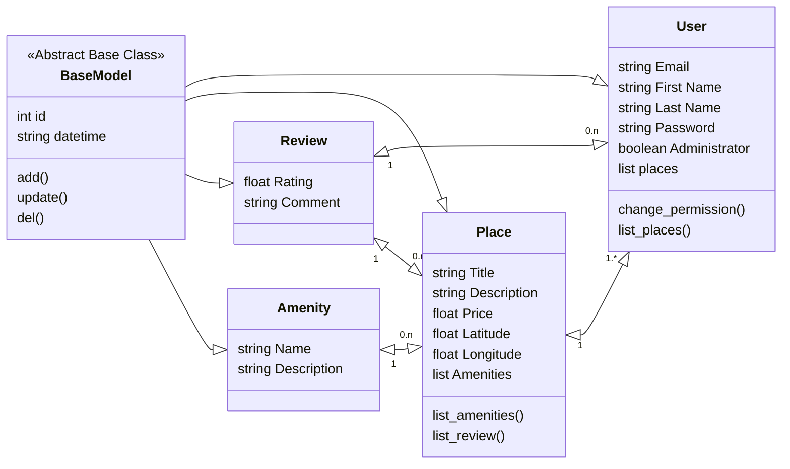

# Objective

Create a high-level package diagram that illustrates the three-layer architecture of the HBnB application and the communication between these layers via the facade pattern. This diagram will provide a conceptual overview of how the different components of the application are organized and how they interact with each other.

---

1.PresentationLayer : This layer handles the interaction between the user and the application. It includes all the services and APIs that are exposed to the users.|
2.FacadePattern : This layer acts as an intermediary, grouping together calls to differents components of a subsystem and providing a simpler interface for the user.|
3.BusinessLogicLayer : This layer contains the core business logic and the models that represent the entities in the system (e.g., User, Place, Review, Amenity).|
4.PersistenceLayer : This layer is responsible for data storage and retrieval, interacting directly with the database.|

---

