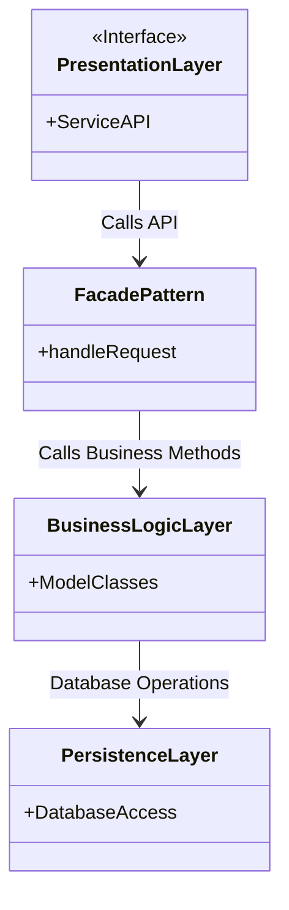
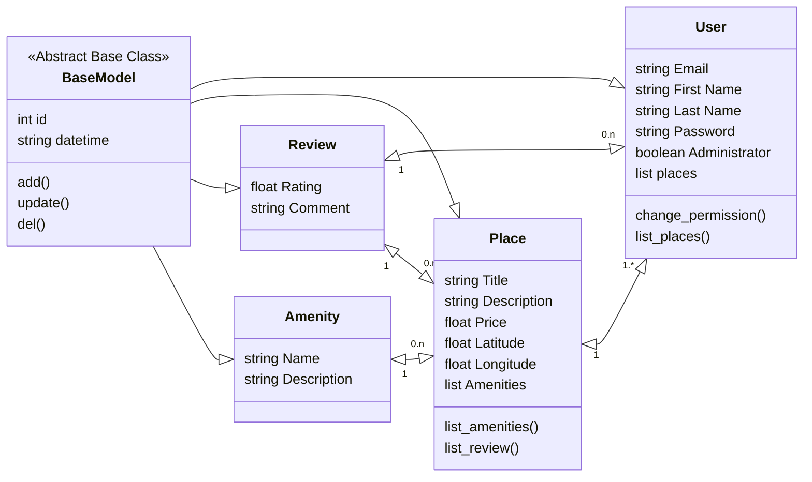
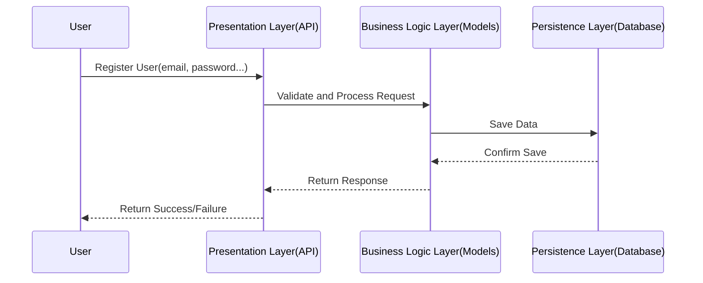
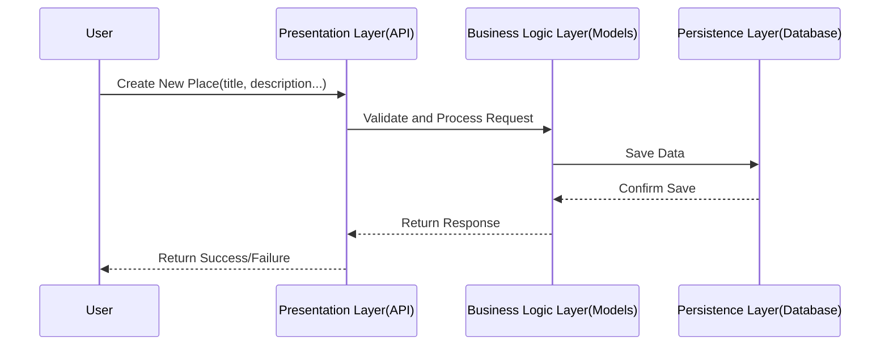
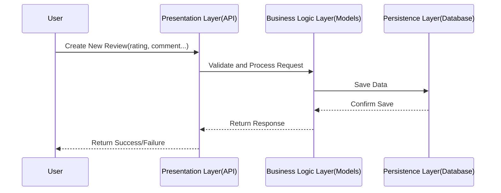
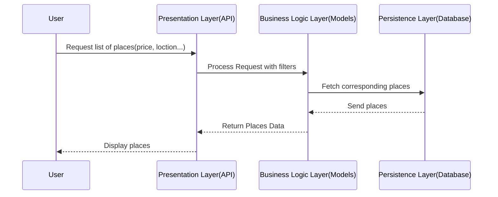

# Objective

Create a high-level package diagram that illustrates the three-layer architecture of the HBnB application and the communication between these layers via the facade pattern. This diagram will provide a conceptual overview of how the different components of the application are organized and how they interact with each other.

---

1.PresentationLayer : This layer handles the interaction between the user and the application. It includes all the services and APIs that are exposed to the users.\
2.FacadePattern : This layer acts as an intermediary, grouping together calls to differents components of a subsystem and providing a simpler interface for the user.\
3.BusinessLogicLayer : This layer contains the core business logic and the models that represent the entities in the system (e.g., User, Place, Review, Amenity).\
4.PersistenceLayer : This layer is responsible for data storage and retrieval, interacting directly with the database.

---

# Objective

Design a detailed class diagram for the Business Logic layer of the HBnB application. This diagram will depict the entities within this layer, their attributes, methods, and the relationships between them. The primary goal is to provide a clear and detailed visual representation of the core business logic, focusing on the key entities: User, Place, Review, and Amenity.

---

## Class Description

User : class containing user information like names, email, password... It can list places created.\
Place : class containing places information like description, price, location... It can list associated amenities and reviews.\
Review : class containing reviews information like ratings and comments.\
Amenity : class containing amenities information like name and description.\
BaseModel : Abstract Base Class containing information common to all classes of the BusinessLogicLayer

## Class Relationships

All classes inherits attributes and methods from ABC BaseModel\
Users : can creates multiple reviews and owns multiples places\
Places : owned by a User, can have list of amenities and can be reviewed multiple times.\
Amenities : associated with a Place.\
Reviews : can be created by User about Place.

---

# Objective

Develop sequence diagrams for at least four different API calls to illustrate the interaction between the layers (Presentation, Business Logic, Persistence) and the flow of information within the HBnB application. The sequence diagrams will help visualize how different components of the system interact to fulfill specific use cases, showing the step-by-step process of handling API requests.

---

## User Registration

### A user signs up for a new account.

## Place Creation

### A user creates a new place listing.

## Review Submission

### A user submits a review for a place.

## Fetching a List of Places

### A user requests a list of places based on certain criteria.

