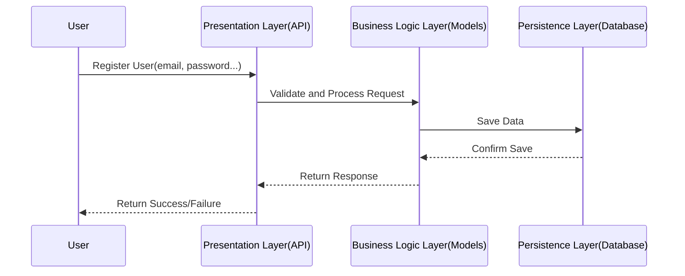
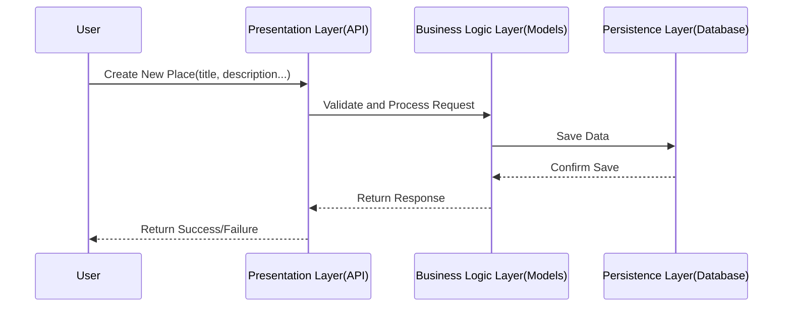
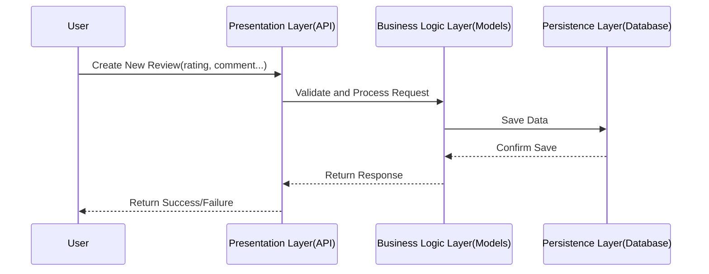
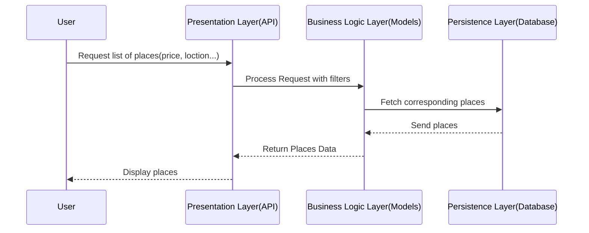

```mermaid
sequenceDiagram
participant User
participant Presentation Layer(API)
participant Business Logic Layer(Models)
participant Persistence Layer(Database)

User->>Presentation Layer(API): Register User(email, password...)
Presentation Layer(API)->>Business Logic Layer(Models): Validate and Process Request
Business Logic Layer(Models)->>Persistence Layer(Database): Save Data
Persistence Layer(Database)-->>Business Logic Layer(Models): Confirm Save
Business Logic Layer(Models)-->>Presentation Layer(API): Return Response
Presentation Layer(API)-->>User: Return Success/Failure
```

```mermaid
sequenceDiagram
participant User
participant Presentation Layer(API)
participant Business Logic Layer(Models)
participant Persistence Layer(Database)

User->>Presentation Layer(API): Create New Place(title, description...)
Presentation Layer(API)->>Business Logic Layer(Models): Validate and Process Request
Business Logic Layer(Models)->>Persistence Layer(Database): Save Data
Persistence Layer(Database)-->>Business Logic Layer(Models): Confirm Save
Business Logic Layer(Models)-->>Presentation Layer(API): Return Response
Presentation Layer(API)-->>User: Return Success/Failure
```

```mermaid
sequenceDiagram
participant User
participant Presentation Layer(API)
participant Business Logic Layer(Models)
participant Persistence Layer(Database)

User->>Presentation Layer(API): Create New Review(rating, comment...)
Presentation Layer(API)->>Business Logic Layer(Models): Validate and Process Request
Business Logic Layer(Models)->>Persistence Layer(Database): Save Data
Persistence Layer(Database)-->>Business Logic Layer(Models): Confirm Save
Business Logic Layer(Models)-->>Presentation Layer(API): Return Response
Presentation Layer(API)-->>User: Return Success/Failure
```

```mermaid
sequenceDiagram
participant User
participant Presentation Layer(API)
participant Business Logic Layer(Models)
participant Persistence Layer(Database)

User->>Presentation Layer(API): Request list of places(price, loction...)
Presentation Layer(API)->>Business Logic Layer(Models): Process Request with filters
Business Logic Layer(Models)->>Persistence Layer(Database): Fetch corresponding places
Persistence Layer(Database)-->>Business Logic Layer(Models): Send places
Business Logic Layer(Models)-->>Presentation Layer(API): Return Places Data
Presentation Layer(API)-->>User: Display places
```