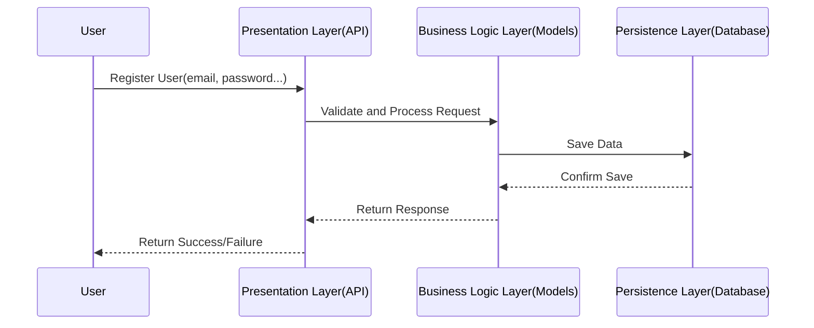
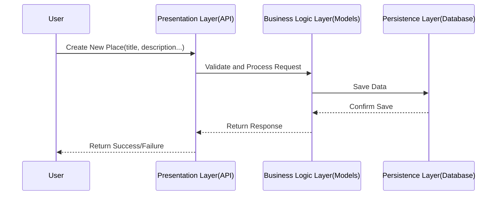
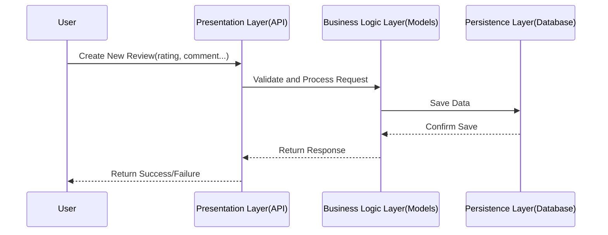
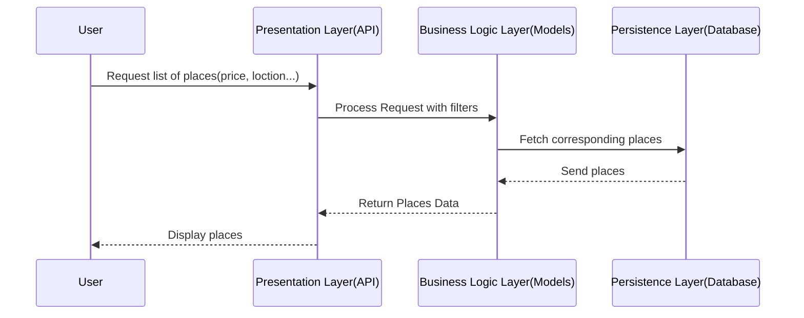

# Objective

Develop sequence diagrams for at least four different API calls to illustrate the interaction between the layers (Presentation, Business Logic, Persistence) and the flow of information within the HBnB application. The sequence diagrams will help visualize how different components of the system interact to fulfill specific use cases, showing the step-by-step process of handling API requests.

---

## User Registration

### A user signs up for a new account.

This API call uses input data to create a new User. User gives datas to the Presentation Layer. The Presentation Layer sends the datas to the Business Logic Layer to create the new User. Then the Business Logic Layer sends the new User to Persistence Layer to save it in the database. Finally, each layer send success or failure response to previous layer up to the user.

## Place Creation

### A user creates a new place listing.

This API call uses input data to create a new Place. User gives datas to the Presentation Layer. The Presentation Layer sends the datas to the Business Logic Layer to create the new Place. Then the Business Logic Layer sends the new Place to Persistence Layer to save it in the database. Finally, each layer send success or failure response to previous layer up to the user.

## Review Submission

### A user submits a review for a place.

This API call uses input data to create a new Review. User gives datas to the Presentation Layer. The Presentation Layer sends the datas to the Business Logic Layer to create the new Review. Then the Business Logic Layer sends the new Review to Persistence Layer to save it in the database. Finally, each layer send success or failure response to previous layer up to the user.

## Fetching a List of Places

### A user requests a list of places based on certain criteria.

This API call uses input data to retrieve Places. User gives datas to the Presentation Layer. The Presentation Layer sends the datas to the Business Logic Layer to apply filters. Then the Business Logic Layer fetch the corresponding places from Persistence Layer. Persistence Layer send Places to Business Logic Layer. Business Logic Layer return these Places datas to Presentation Layer. Presentation Layer display the list of Places.