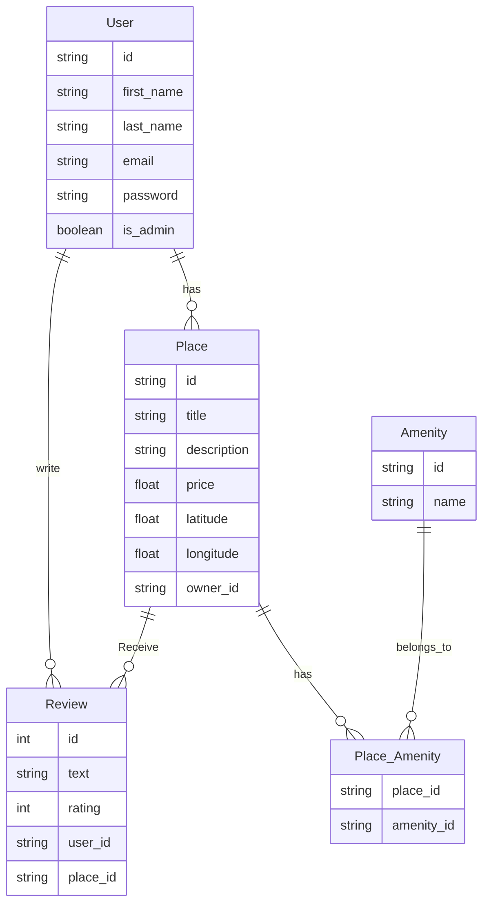

```mermaid
erDiagram
       User {
            string id
            string first_name
            string last_name
            string email
            string password
            boolean is_admin
       }

        Place {
            string id
            string title
            string description
            float price
            float latitude
            float longitude
            string owner_id
       }

        Review {
            int id
            string text
            int rating
            string user_id
            string place_id
       }

        Amenity {
            string id
            string name
       }

        Place_Amenity {
            string place_id
            string amenity_id
        }

        User ||--o{ Place : has
        User ||--o{ Review : write
        Place ||--o{ Review : Receive
        Place ||--o{ Place_Amenity : has
        Amenity ||--o{ Place_Amenity : belongs_to
```